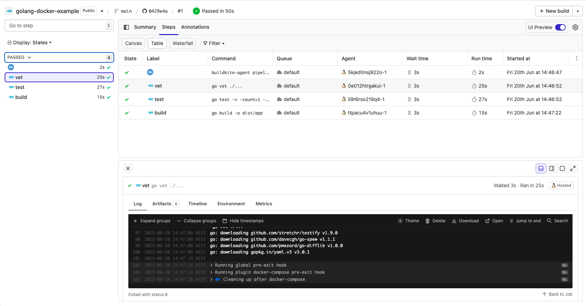

# Buildkite Golang Docker Pipeline Example

[](https://buildkite.com/buildkite/golang-docker-example/builds/latest?branch=main)
[](https://buildkite.com/new)

This repository is an example [Buildkite](https://buildkite.com/) pipeline that runs tests for a [Golang](https://go.dev) project inside [Docker](https://docker.com).

👉 **See this example in action:** [buildkite/golang-docker-example](https://buildkite.com/buildkite/golang-docker-example/builds/latest?branch=main)

See the full [Getting Started Guide](https://buildkite.com/docs/guides/getting-started) for step-by-step instructions on how to get this running, or try it yourself:

[](https://buildkite.com/new)

<a href="https://buildkite.com/buildkite/golang-docker-example/builds/latest?branch=main">
  
</a>

<!-- docs:start -->

## How it works

This example uses a Docker-based workflow to run Go tests:
- The pipeline runs `go test` and `go vet` inside a container.
- The container is defined using [`Dockerfile`](Dockerfile) and [`docker-compose.yml`](docker-compose.yml).
- The Buildkite pipeline uploads steps using `pipeline.yml`.

This is ideal if you want to containerize your builds or match production environments more closely.

## Try it yourself

To use this pattern in your own Go project:

1. Make sure Docker and Docker Compose are installed. See: [Install Docker Compose](https://docs.docker.com/compose/install/)
2. Copy the example config into your repo:

```sh
cd /your/golang/repo

curl -O https://raw.githubusercontent.com/buildkite/golang-docker-example/main/Dockerfile
curl -O https://raw.githubusercontent.com/buildkite/golang-docker-example/main/docker-compose.yml
```

<!-- docs:end -->

## License

See [LICENSE.md](LICENSE.md) (MIT)
