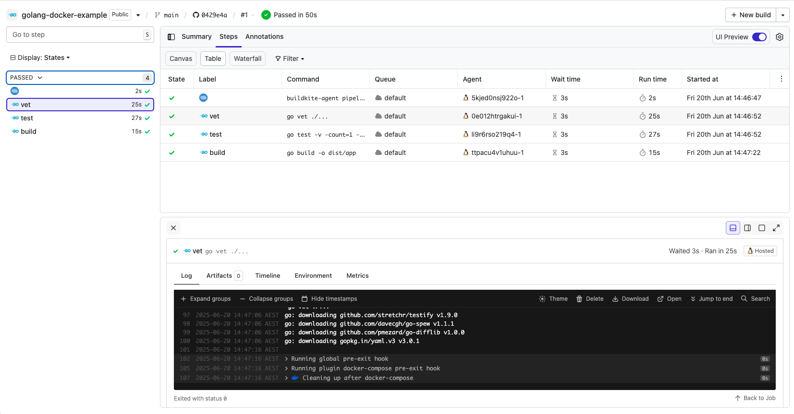

# Buildkite Golang Docker Pipeline Example

[](https://buildkite.com/buildkite/golang-docker-example)
[](https://buildkite.com/new)

This repository is an example on how to test a [Golang](https://go.dev) project through [Docker](https://docker.com) using Buildkite.

See the full [Getting Started Guide](https://buildkite.com/docs/guides/getting-started) for step-by-step instructions on how to get this running, or [Add to Buildkite](https://buildkite.com/new) to try it yourself.

<a href="https://buildkite.com/buildkite/golang-docker-example/builds?branch=main"></a>

## Using in your own build pipelines

1. Ensure `docker-compose` is installed on your build system. For details on how to do this, see: https://docs.docker.com/compose/install/

2. Use our `Dockerfile` and `docker-compose.yml` files as defaults:

   ```sh
   cd /your/golang/repo
   curl -o Dockerfile https://raw.githubusercontent.com/buildkite/golang-docker-example/master/Dockerfile
   curl -o docker-compose.yml https://raw.githubusercontent.com/buildkite/golang-docker-example/master/docker-compose.yml
   ```

## License

See [Licence.md](Licence.md) (MIT)
